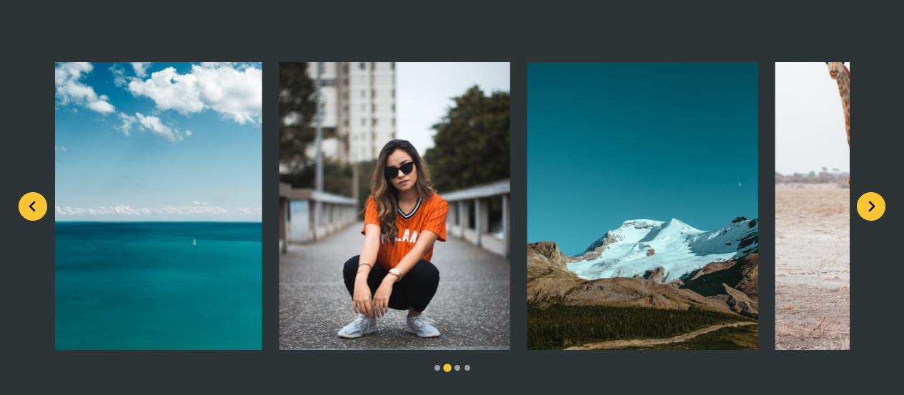

# Splidejs Carousel- <a href="https://splidejs.com/">Go to link</a>
<svg width="200" height="200" version="1.1" viewBox="0 0 161 56.1"><defs><linearGradient id="logo-text-d"><stop stop-color="#c0e900" offset="0"></stop><stop stop-color="#00c3f3" offset="1"></stop></linearGradient><linearGradient id="logo-text-e" x1="-17.6" x2="-39" y1="125" y2="125" gradientTransform="rotate(180 -5.58 76.6)" gradientUnits="userSpaceOnUse" xlink:href="#logo-text-d"></linearGradient><linearGradient id="logo-text-f" x1="-42.4" x2="-11.2" y1="125" y2="125" gradientTransform="translate(67.3 -97.1)" gradientUnits="userSpaceOnUse" xlink:href="#logo-text-d"></linearGradient></defs><path d="m9.35 18.7 28.1 28.1-9.35 9.35-28.1-28.1zm-9.35 9.35 28.1-28.1 9.35 9.35-28.1 28.1z" fill="url(#logo-text-e)" stroke-linecap="square" stroke-linejoin="round" stroke-width="1.14" style="paint-order: stroke;"></path><path d="m46.8 37.4-28.1-28.1 9.35-9.35 28.1 28.1zm9.35-9.35-28.1 28.1-9.35-9.35 28.1-28.1z" fill="url(#logo-text-f)" stroke-linecap="square" stroke-linejoin="round" stroke-width="1.14" style="paint-order: stroke;"></path><path d="m80 32.7q0 3.65-2.82 5.77-2.64 2.02-6.74 2.02-6.22 0-9.39-3.27l3.89-3.89q1.74 1.74 5.53 1.74 3.55 0 3.55-2.22 0-1.81-2.12-2.12l-2.99-0.417q-6.68-0.939-6.68-7.16 0-3.44 2.43-5.63 2.47-2.19 6.6-2.19 5.39 0 8.34 2.96l-3.82 3.82q-1.46-1.46-4.69-1.46-1.46 0-2.3 0.73-0.695 0.66-0.695 1.56 0 0.66 0.522 1.18t1.67 0.695l2.99 0.417q3.41 0.487 5.04 2.26 1.67 1.77 1.67 5.22z" fill="#ffffff"></path><path d="m99.8 31q0 3.06-0.174 4.28-0.348 2.36-1.56 3.58-1.7 1.7-4.52 1.7-2.61 0-4.17-1.56v7.4h-5.7v-24.8h5.53v1.53q1.74-1.74 4.31-1.74 2.85 0 4.55 1.7 1.22 1.22 1.56 3.58 0.174 1.22 0.174 4.28zm-5.7 0q0-2.33-0.382-3.23-0.522-1.18-1.98-1.18t-1.98 1.18q-0.382 0.904-0.382 3.23 0 2.33 0.382 3.23 0.522 1.18 1.98 1.18t1.98-1.18q0.382-0.904 0.382-3.23z" fill="#ffffff"></path><path d="m112 40.3h-3.02q-2.89 0-4.45-1.81-1.36-1.53-1.36-3.72v-19.2h5.7v18.8q0 1.15 1.15 1.15h1.98z" fill="#ffffff"></path><path d="m122 17.3q0 1.42-1.04 2.47-1.01 1.01-2.43 1.01t-2.47-1.01q-1.01-1.04-1.01-2.47t1.01-2.43q1.04-1.04 2.47-1.04t2.43 1.04q1.04 1.01 1.04 2.43zm-0.626 23h-5.7v-18h5.7z" fill="#ffffff"></path><path d="m141 40.3h-5.53v-1.53q-1.74 1.74-4.31 1.74-2.85 0-4.55-1.7-1.22-1.22-1.56-3.58-0.174-1.22-0.174-4.28t0.174-4.28q0.348-2.36 1.56-3.58 1.7-1.7 4.52-1.7 2.61 0 4.17 1.56v-7.4h5.7zm-5.7-9.35q0-2.33-0.382-3.23-0.522-1.18-1.98-1.18-1.46 0-1.98 1.18-0.382 0.904-0.382 3.23 0 2.33 0.382 3.23 0.522 1.18 1.98 1.18 1.46 0 1.98-1.18 0.382-0.904 0.382-3.23z" fill="#ffffff"></path><path d="m161 32.8h-11.2q0 1.22 0.869 2.02 0.904 0.904 2.43 0.904 2.3 0 3.86-1.56l3.41 3.41q-1.53 1.53-3.06 2.19-1.74 0.765-4.21 0.765-8.9 0-8.9-9.56 0-4.48 2.36-7.09 2.26-2.47 6.01-2.47 3.93 0 6.26 2.61 2.16 2.43 2.16 6.26zm-5.63-3.79q0-1.32-0.765-2.12-0.73-0.8-2.02-0.8-1.81 0-2.47 1.46-0.313 0.695-0.313 1.46z" fill="#ffffff"></path></svg>

## Steps to be followed to use splide slider:

* create a `index.html` file with the folowing tags
```
<!DOCTYPE html>
<html lang="en">
<head>
    <meta charset="UTF-8">
    <meta name="viewport" content="width=device-width, initial-scale=1.0">
    <title>Document</title>
</head>
<body>
    
</body>
</html>
``` 
* You can include splide using Npm, by Downloading the splidejs assets, or by using the cdn link:

* if you are  include this library from CDN
`use the Cdn link:`
```
 <!-- css cdn link -->
    <link rel="stylesheet" href="https://cdn.jsdelivr.net/npm/@splidejs/splide@4.1.4/dist/css/splide.min.css">
<!-- js cdn link -->
    <script src="https://cdn.jsdelivr.net/npm/@splidejs/splide@4.1.4/dist/js/splide.min.js"></script>

```

* Using the CDN link like this
```
<!DOCTYPE html>
<html lang="en">
<head>
    <meta charset="UTF-8">
    <meta name="viewport" content="width=device-width, initial-scale=1.0">
    <title>Document</title>
    <!-- css cdn link -->
    <link rel="stylesheet" href="https://cdn.jsdelivr.net/npm/@splidejs/splide@4.1.4/dist/css/splide.min.css">
</head>
<body>
    
    <!-- js cdn link -->
    <script src="https://cdn.jsdelivr.net/npm/@splidejs/splide@4.1.4/dist/js/splide.min.js"></script>
</body>
</html>
```


* Next, build your carousel with HTML.

```
<div class="splide" role="group" aria-label="Splide Basic HTML Example">
  <div class="splide__track">
		<ul class="splide__list">
			<li class="splide__slide"></li>
			<li class="splide__slide"></li>
			<li class="splide__slide"></li>
		</ul>
  </div>
</div>
```

* Type the script inside the script tag after the js cdn link before the enclosing of tyhe body tag.

```
  <script>
      const splide = new Splide(".splide",{
        perPage:3,
        gap:'1.5rem',
        // This gap is for splide__track
        padding:'3rem', 
        type:'loop',
        drag:'free',
        //draging the image in the corner to see to effect 
        snap:true,
        // pagination:false,
        // autoplay:true
      });
      splide.mount();
    </script>
```

* Then add the custom css if you want to make it look awesome!
`Note: indie the custom style.css that you created`

```
body{
    display:grid;
    place-items: center;
    height: 100vh;
    background-color: #2d3436;
}

img{
    max-width: 100%;
}
.splide_wrapper{
    padding: 50px 15px;
    max-width: 1240px;
    margin: 0 auto;
}
.splide__arrow{
    opacity:1;
    width:2.5rem;
    height: 2.5rem;
    background-color:#fbc531;
}
.splide__pagination{
    bottom:-2rem;
}
.splide_wrapper .splide__pagination__page.is-active{
    opacity: 1;
    background-color: #fbc531;
}

@media screen and (min-width:640px){
    .splide_wrapper .splide{
        padding: 0 4rem;
    }
}
```

## Output



